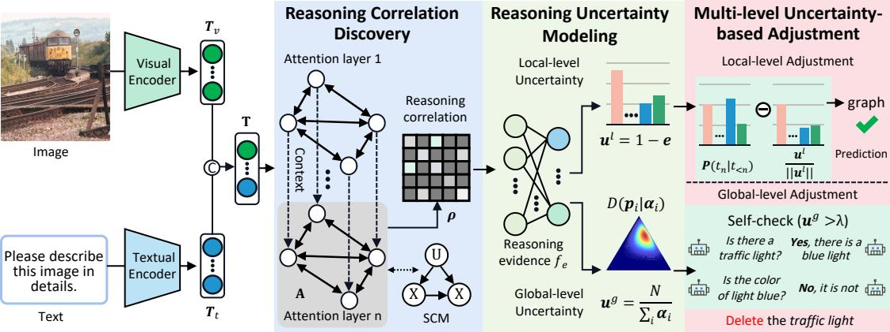
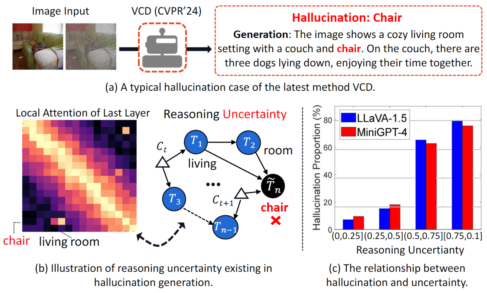
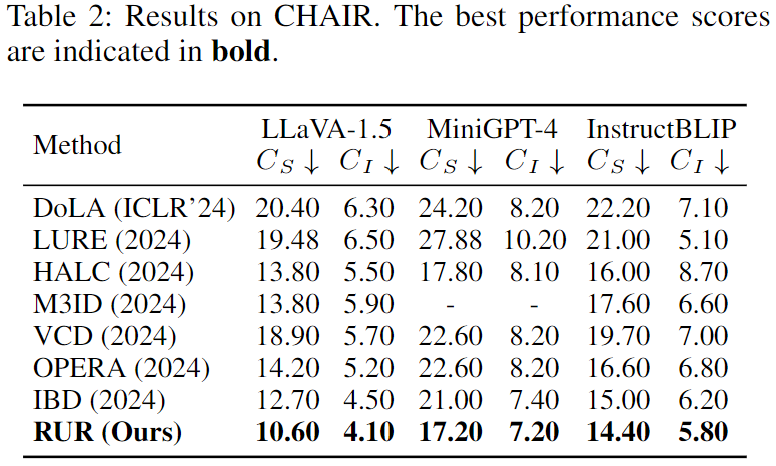
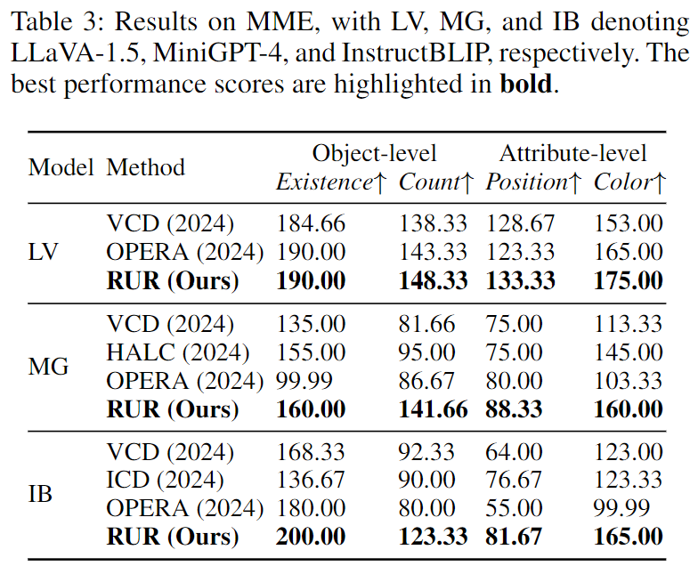
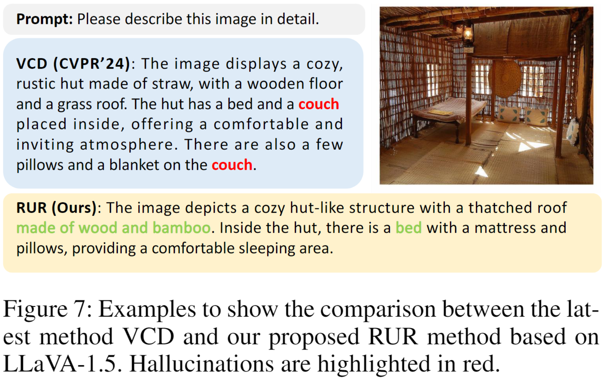

## Introduction
This is the source code of "Mitigating Hallucinations in Large Vision-Language Models via Reasoning Uncertainty-guided Refinement"

## Mitigating Hallucinations in Large Vision-Language Models via Reasoning Uncertainty-guided Refinement
Our RUR model comprises three components: 1) Reasoning Correlation Discovery (RCD); 2) Reasoning Uncertainty Modeling (RUM); and 3) Multi-level Uncertainty-based Adjustment (MUA).




## Proposed Model (RUR)
* Reasoning Correlation Discovery
* Reasoning Uncertainty Modeling
* Multi-level Uncertainty-based Adjustment


## Motivation

Illustrative examples of existing problems: (a) A representative hallucination case of the latest method Visual Contrastive Decoding (VCD). (b) Illustration of reasoning uncertainty, where C denotes the exogenous node (confounder). (c) The relationship between the hallucination frequency and the degree of reasoning uncertainty.

## Results





## Retrieval Examples



## Setup
```text
conda env create -f environment.yml
conda activate opera
python -m pip install -e transformers-4.29.2
```

### **Datasets：**

**MSCOCO 2014 dataset:** Please download [here](https://cocodataset.org/#home) and extract it in your data path.

**Visual Genome**: Download these data from [Visual Genome v1.2](https://homes.cs.washington.edu/~ranjay/visualgenome/api.html) and extract it in your data path:

1. images (both part1 and part2)
2. image meta-data
3. region descriptions

**MME:** The data of MME could get from [MME](https://github.com/BradyFU/Awesome-Multimodal-Large-Language-Models/tree/Evaluation) and extract it in your data path.

**GPT-4 evaluation**: The shr annotations of VG dataset used in GPT-4 evaluation could be download [here](https://huggingface.co/datasets/juliozhao/SHR/tree/main) and extract it in your data path.

### Models:

You need to prepare the following checkpoints of 7B base models:

- Download [LLaVA-1.5 merged 7B model](https://huggingface.co/liuhaotian/llava-v1.5-7b) and specify it at Line 14 of `eval_configs/llava-1.5_eval.yaml`.
- Download [Vicuna 7B v1.1 model](https://github.com/lm-sys/FastChat) and specify it at Line 25 of `minigpt4/configs/models/blip2_instruct_vicuna7b.yaml`.
- Download [Vicuna 7B v0 model](https://huggingface.co/Vision-CAIR/vicuna-7b/tree/main) and specify it at Line 18 of `minigpt4/configs/models/minigpt4_vicuna0.yaml`.
- Download [MiniGPT-4 7B pretrained weights](https://drive.google.com/file/d/1RY9jV0dyqLX-o38LrumkKRh6Jtaop58R/view?usp=sharing) and specify it at Line 8 of `eval_configs/minigpt4_eval.yaml`.


## Evaluation

### POPE:

```
python check_pope.py --model MODEL_NAME --data_path /path/to/COCO --type pope_type --gpu-id GPU_IDs
```

After obtaining the answers, run pope_eval.py to get the POPE evaluation results.


### CHAIR:

```
python check_chair.py --model MODEL_NAME --data_path /path/to/COCO --gpu-id GPU_IDs
```

After obtaining the image descriptions, run chair_eval.py to get the CHAIR evaluation results.


### MME:

```
python check_mme.py --model MODEL_NAME --data_path /path/to/COCO --type mme_type --gpu-id GPU_IDs
```

After obtaining the answers, run mme_eval.py to get the MME evaluation results.


### GPT-4 evaluation:

```
python check_gpt4.py --model MODEL_NAME --vg-path /path/to/VG --shr-path /path/to/shr --gpu-id GPU_IDs
```

Enter your api_key on Line 64.


### GPT-4v evaluation:

```
python check_gpt4v.py --model MODEL_NAME --data_path /path/to/COCO --gpu-id GPU_IDs
```

Enter your api_key on Line 62 and Line 253.
